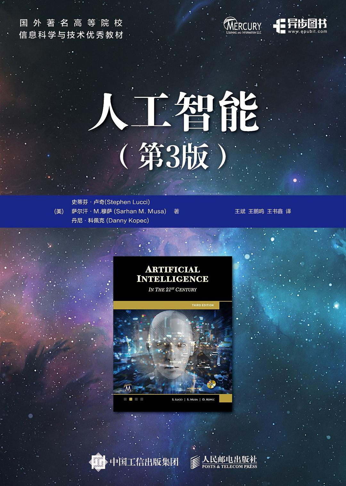

# 《人工智能第3版》读书笔记

# 第一部分 引言

## [第01章-人工智能概述](第01章-人工智能概述.md)

# 第二部分 基础知识

## [第02章-盲目搜索](第02章-盲目搜索.md)
## [第03章-知情搜索](第03章-知情搜索.md)
## 第04章-博弈中的搜索
## 第05章-人工智能中的逻辑
## 第06章-知识表示
## 第07章-产生式系统

# 第三部分 基于知识的系统

## 第08章-人工智能中的不确定性
## 第09章-专家系统
## 第10章-机器学习第一部分：神经网络
## 第11章-机器学习第二部分：深度学习
## 第12章-受大自然启发的搜索

# 第四部分 高级专题

## 第13章-自然语言理解
## 第14章-自动规划

# 第五部分 现在和未来

## 第15章-机器人技术
## 第16章-高级计算机博弈
## 第17章-AI大事记

# 第六部分 安全和编程

## 第18章-网络安全中的人工智能（选读）
## 第19章-人工智能编程工具（选读） 

***

